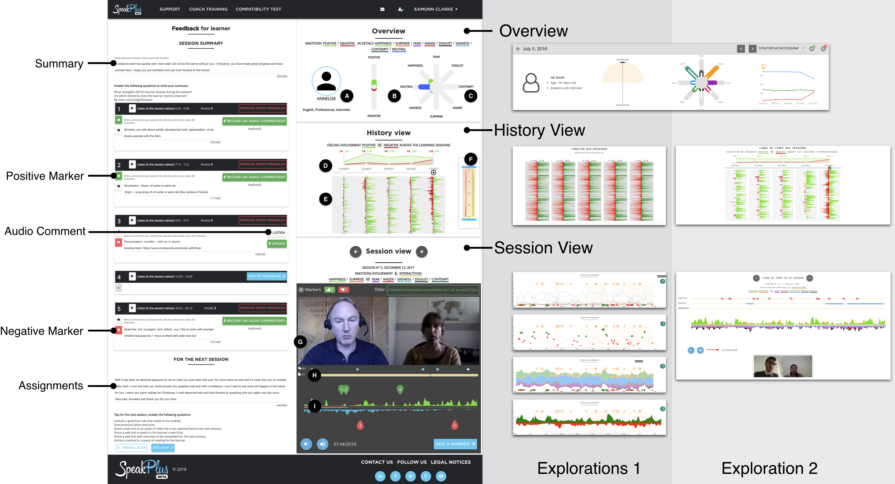

# Emodash: Supporting Emotion Retrospective Awareness in Online Learning

This repository contains supplemental material for the IJHCS paper Emodash: Supporting Emotion Retrospective Awareness in Online Learning by Mohamed Ezzaouia (University of Lyon, LIRIS), Aurélien Tabard (University of Lyon, LIRIS), Elise Lavoué (IAE Lyon,University of Lyon, LIRIS).

## Abstract

**Figure**: Emodash overview with different design explorations.

We present Emodash, an interactive dashboard for visualizing learners’ emotions in a video-conferencing learning environment. Socio-affective relationships play an important role in learning processes and in learning outcomes, but they are  harder  to  develop  in  online-learning. This  can  be  explained  by  a  lack  of emotion awareness due to the asynchronous interactions, technical challenges, and tutors’ focus on properly conducting the learning activity and gearing towards pedagogical outcomes. We conducted an eight-week long field study with five professional tutors on how they used Emodash while writing feedback to learners  after  language  learning  sessions. We  found  that  Emodash  led  tutors who were already sensitive to learners’ emotions to incorporate more affective elements in their reports, suggesting a stronger awareness of learners’ emotions. This led tutors to write more formative and less summative feedback.  Furthermore, our results suggest that an overview of learners’ emotions on all sessions without detailed information on each session may be sufficient to better consider learners’ emotions. Finally, the dashboard led tutors to reflect on the way they conduct their lessons, and they used it as a proxy to get feedback on their teaching.

## Highlights
1. Design and in the wild study of an interactive dashboard called Emodash for retrospective awareness of learners' emotions in a video-conferencing language learning environment.
2. Tutors mostly appreciate the overview elements of the dashboard, and used the detailed session view mostly to navigate through the session recording.
3. Emodash led tutors to write more formative and less summative feedback reports than without the dashboard.
4. Emodash led tutors to write more affective feedback reports than without the dashboard.
5. Visualizing learners’ emotions led to an increase in tutors self-awareness and reflection.

## Maintainer
This repository is maintained by [Mohamed Ezzaouia](https://github.com/ezzaouia).

