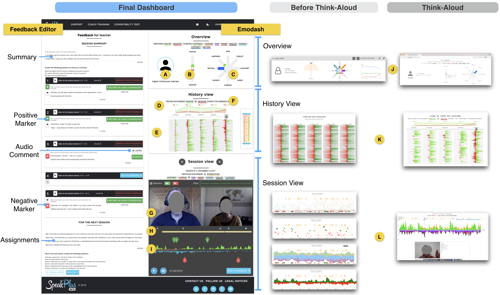

# Emodash: Supporting Retrospective Awareness of Emotions in Online Learning

This repository contains supplemental material for the paper Emodash: Supporting Retrospective Awareness of Emotions in Online Learning by Mohamed Ez-zaouia (IAE Lyon, University of Lyon, LIRIS), Aurélien Tabard (University of Lyon, LIRIS), Elise Lavoué (IAE Lyon, University of Lyon, LIRIS).

## Abstract

**Figure**: Emodash overview with different design explorations.

We present Emodash, an interactive dashboard supporting tutors’ retrospective awareness of learners’ emotions in a video-conferencing learning environment. Socio-affective relationships play an important role in learning processes and learning outcomes, but they are harder to develop in online-learning. This can be explained by a lack of emotion awareness due to the asynchronous interactions, technical challenges, and tutors’ focus on properly conducting the learning activity and gearing towards pedagogical outcomes. We conducted an eight-week long field study with five professional tutors on how they used Emodash while writing feedback to learners after language learning sessions. We found that EMODASH led tutors who were already sensitive to learners’ emotions to incorporate more affective elements in their reports, suggesting a stronger awareness of learners’ emotions. Tutors also wrote more formative and less summative feedback. Furthermore, our results suggest that glanceable visualizations of learners’ emotions may be preferred and sufficient to foster tutors’ awareness of learners’ emotions. Finally, the dashboard led tutors to reflect on the way they conduct their lessons, using learners’ positive emotions as a proxy evaluation of their teaching.

## Highlights
1. Design and in-the-wild study of Emodash, an interactive dashboard designed to foster retrospective awareness of learners' emotions in  online learning.
2. Tutors mostly appreciate the overview elements of the dashboard, and used the detailed session view mostly to navigate through the session recording.
3. Emodash led tutors to write more formative and less summative feedback reports than without the dashboard.
4. Emodash led tutors to write more affective feedback reports than without the dashboard.
5. Visualizing learners’ emotions led to an increase in tutors self-awareness and reflection.

**Figure**: The effect size of Category’s levels under with-without conditions with the associated confidence intervals.

## Maintainer
This repository is maintained by [Mohamed Ez-zaouia](mailto:ezzaouia.mohamed@gmail.com).

